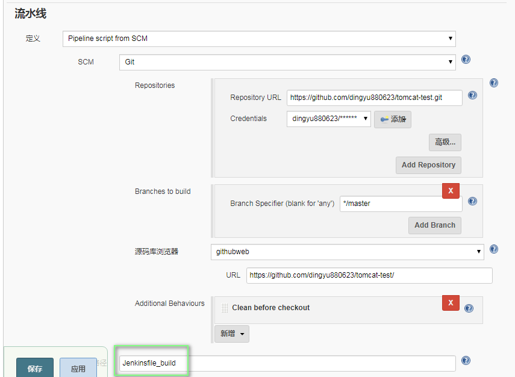
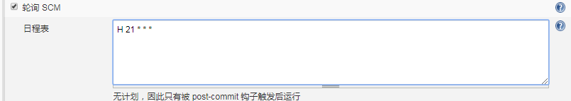
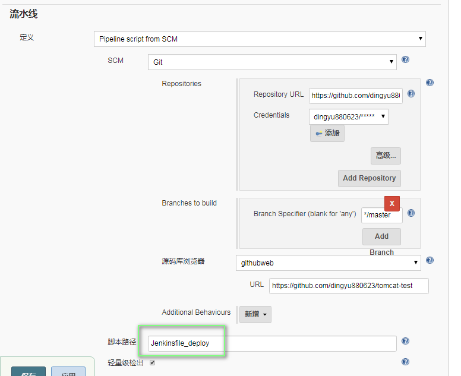

##环境准备

* 启动一台ubuntu虚机
    * 以ubuntu16.04为例进行，启动后配置虚机，保证能通大网，方便安装软件

* 虚机上软件装相应的
    * apt install docker.io  
    * apt install maven   
    * apt install jdk
    * apt install ansible
    * pip install docker-py
    

##为开发搭建可测试环境

* 对应业务代码
    ```
    server
        src
        pom.xml
    ```
  修改业务代码后，直接执行同级目录下 home_build.sh 
  就可以通过xx.xx.xx.xx:8080查看对应该服务变化
  * 


* 启动jenkins容器，并配置github相关
    * docker run -d -p 8081:8080 -p 50000:50000 -v /var/jenkins_home:/var/jenkins_home -v /etc/localtime:/etc/localtime --name my_jenkins jenkins/jenkins


* 添加自动构建任务（build）
  * 
  * 当有代码merge时，会触发构建，对应的版本会推送到/var/package目录下


* 添加定时部署任务
  * 
  * 
  * 版本会发布到/var/publish目录下